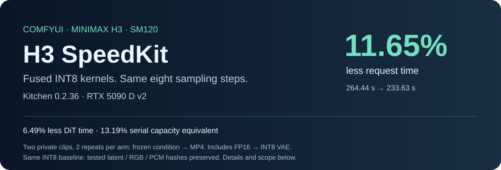
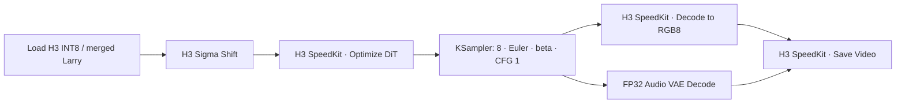

<p align="center"></p>

<p align="center"><a href="README.zh-CN.md">中文</a> · <a href="docs/INSTALL.md">Install</a> · <a href="docs/MIGRATION-036.md">How it works</a> · <a href="docs/BENCHMARK-036.md">Benchmarks</a> · <a href="workflows/README.md">Workflows</a></p>

# Make your H3 workflow faster

**A ComfyUI plugin with source-built INT8 kernels for RTX 5090 D v2.** Keep Larry v4, eight steps, your seed and your sampler. Add a model node for fused DiT execution and optional video nodes for INT8 VAE, RGB8 transfer and MP4 output.

**Kitchen 0.2.36: 264.44 → 233.63 seconds per measured request — 11.65% less time.** Same INT8 VAE on both sides: **6.72% less time**. These are measured averages on two private representative clips, two formal repeats per arm. Timing starts from prepared conditioning and ends with a local MP4; it excludes reference/text encoding, cold checkpoint reads and network. The large comparison includes FP16 → INT8 VAE. [Full protocol and raw records →](docs/BENCHMARK-036.md)

| What changes | Measured result |
|---|---:|
| DiT operators, same INT8 precision and 8 steps | **6.49% less DiT time** |
| Full measured cycle, native FP16 VAE → optimized INT8 VAE | **11.65% less time** |
| Inverse-latency capacity equivalent | **+13.19%**; not a sustained serving benchmark |
| Same INT8 path, video/audio latents + RGB + PCM | **Exact signatures on all four formal .36 requests** |
| FP16 → INT8 VAE, historical 15 identical latents | **58.67 dB raw PSNR**, MP4 SSIM **0.98907**, LPIPS **0.00759** |

INT8 VAE has a very small measured difference from FP16; it is not pixel-identical. The DiT fusion preserves the selected INT8 baseline on tested inputs, not BF16 dense arithmetic. Audio stays FP32 on GPU.

**Public-input check:** 768×512, 124 frames, public merged Larry: **19.31 → 16.76 s (−13.19%)**, all four output signatures equal. First-use verification excluded; [separate records](evidence/public-input-medium.json).

## Quick start

Initial source release: **Linux, RTX 5090 D v2 (SM120), Torch 2.12.0+cu130, Triton 3.7.0, Kitchen 0.2.36 and the pinned ComfyUI H3 revision**. See the [exact compatibility matrix](configs/compatibility.json). Use a separate environment; this package does not upgrade Torch automatically.

```bash
cd ComfyUI/custom_nodes
git clone https://github.com/Tokha233/ComfyUI-H3-SpeedKit.git
cd ComfyUI-H3-SpeedKit
python -m pip install comfy-kitchen==0.2.36 av
git clone --branch v4.5.0 --depth 1 https://github.com/NVIDIA/cutlass.git /tmp/h3-cutlass
python tools/build_kernels.py --cutlass /tmp/h3-cutlass
python -m h3_speedkit --probe-cuda
```

Restart ComfyUI with `--disable-cuda-malloc`. Load an INT8 ConvRot H3 model, then connect:



Use **H3 SpeedKit · Video VAE Loader** for the upstream INT8 video VAE. It retains the old reference encoder. For Larry, follow the [one-time merge instructions](docs/INSTALL.md); do not apply a LoRA twice. Unknown compatible layouts run a slower first-use exact comparison before fast reuse. Conflicting patches and unsupported inputs are reported explicitly.

Need regular IMAGE nodes for grading or upscaling? Keep standard VAE Decode and output nodes; the DiT node can be used independently. [Detailed setup, model links and troubleshooting →](docs/INSTALL.md)

## What is inside

- **SM120 dense attention:** three-slot TMA pipeline, resident Q, direct BSHD output and an exact last-block query window.
- **Fused DiT preparation:** native norm + modulation + ConvRot; QKV + RMS/RoPE + quantization; current-input K anchors; fused V preparation.
- **INT8 GEMM:** FC1 raster scheduling and outproj/FC2 gate-residual epilogues with the original BF16 rounding barriers.
- **Video output:** upstream INT8 decoder, old encoder, final-blend RGB8 conversion and two-slot asynchronous D2H.
- **Service integration:** bounded CPU MP4 export queue, with explicit completion and error propagation. Normal ComfyUI nodes wait for the saved file.
- **Reproducibility:** complete CUDA source/build manifests, per-request checks, public-input benchmark CLI and 30 historical optimization records.

[Every optimization and its numerical contract →](docs/MIGRATION-036.md) · [Historical experiments, including rejected approaches →](docs/R85-EXPERIMENTS.md)

**Upstream work:** [10 Kitchen/ComfyUI PRs with tests, measurements and review status](docs/UPSTREAM-BATCH2.zh-CN.md)
are open; some remain drafts pending API releases and integration qualification.
An optional [Indexed Gate node](docs/INDEXED-GATE.md)
isolates PR #219 in a real H3 workflow. It requires a source build of the unmerged
PR and is independent of the complete Optimize DiT node.
[Full upstream scope and the 6.49% DiT comparison (中文)](docs/FULL-UPSTREAM-PLAN.zh-CN.md)
distinguish submitted kernels, remaining model integration and newer ComfyUI changes.

## Validate before comparing

```bash
python -m unittest discover -s tests -v
python tools/verify_kitchen036.py
python tools/verify_metrics.py
python tools/check_repository.py
python benchmarks/run.py --help
```

CPU checks verify tooling and evidence, not GPU performance. `benchmarks/run.py` takes your own reference, public models and prompt, then compares stock/optimized outputs and complete local-file timing. First-use shape verification is intentionally slower. Other GPUs, Windows, newer Torch/ComfyUI and arbitrary model patches require separate qualification. No precompiled wheel or model weights are bundled.

[Hugging Face overview](https://huggingface.co/StellarVoyager/MiniMax-H3-SpeedKit-RTX5090Dv2) · [Kitchen upstream contribution analysis (中文)](docs/KITCHEN-PR-OPPORTUNITIES.zh-CN.md)

## Credits and license

Built on [ComfyUI](https://github.com/Comfy-Org/ComfyUI), [Comfy Kitchen](https://github.com/Comfy-Org/comfy-kitchen), [SageAttention](https://github.com/thu-ml/SageAttention), [CUTLASS](https://github.com/NVIDIA/cutlass), PyTorch and SGLang. [Larry v4](https://huggingface.co/larryvrh/MiniMax-H3-Turbo-Lora) and the INT8 VAE are upstream work. This project contributes hardware-specific adaptations, integration, output engineering and measured validation.

Combined plugin: [GPL-3.0-or-later](LICENSE). Kernel and other file-level licenses are preserved in [NOTICE](NOTICE) and the [provenance index](evidence/kernel-provenance.json). MiniMax H3 weights have a separate community license with geographic and commercial conditions; obtain them under upstream terms. Private prompts, business media and merged weights are not distributed.
