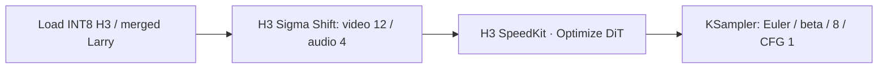
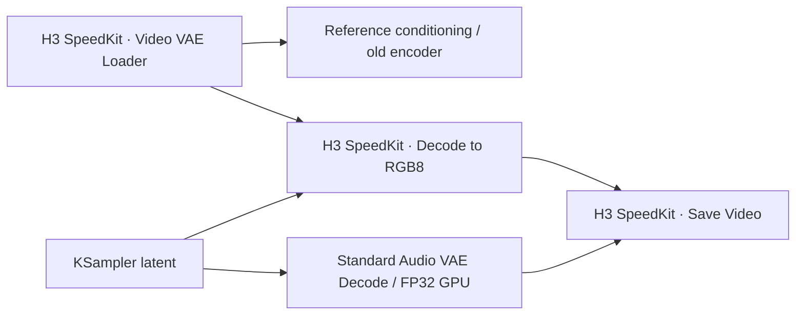

# Install and connect

This is a Linux / RTX 5090 D v2 source release. The supplied API graph has the same node sequence used by the benchmark; the canvas graph is a convenience layout. It does not replace your Python or PyTorch automatically. Use a separate ComfyUI checkout for the pinned release; other workflows can keep their existing environment.

## 1. Match the tested environment

| Component | Tested version |
|---|---|
| GPU | RTX 5090 D v2, SM120, 24 GB |
| PyTorch | 2.12.0+cu130 |
| Triton | 3.7.0 |
| Kitchen | 0.2.36 |
| CUDA Toolkit for building | 13.0 |
| CUTLASS C++ | v4.5.0 |
| ComfyUI H3 implementation | `2504e68d4d9dedb514e172692f13436623f25aed` |

The norm reduction deliberately matches this PyTorch revision. A newer PyTorch is a new numerical qualification, not an automatic upgrade. Newer ComfyUI revisions can use the diagnostics and VAE loader where compatible; the strict DiT node rejects a different H3 source before installing its forward adapter.

```bash
# Optional: create the exact isolated ComfyUI checkout first.
git clone https://github.com/Comfy-Org/ComfyUI.git ComfyUI
cd ComfyUI
git checkout 2504e68d4d9dedb514e172692f13436623f25aed
# Activate your Python environment with the tested Torch/CUDA stack.
# Install requirements while keeping your tested Torch/Triton pins.
python -m pip install -r requirements.txt
# Confirm Torch is still 2.12.0+cu130 before proceeding.

# In that environment:
python -m pip install 'comfy-kitchen==0.2.36'
cd ComfyUI/custom_nodes
git clone https://github.com/Tokha233/ComfyUI-H3-SpeedKit.git
cd ComfyUI-H3-SpeedKit
git clone --branch v4.5.0 --depth 1 https://github.com/NVIDIA/cutlass.git /tmp/h3-cutlass
python tools/build_kernels.py --cutlass /tmp/h3-cutlass
python -m h3_speedkit --probe-cuda
```

`nvcc` must be on PATH; otherwise pass `--nvcc /usr/local/cuda-13.0/bin/nvcc`. The build creates `h3_speedkit/_native/*.so`, per-kernel logs and a SHA-256 manifest. It does not install a different attention package or change global Comfy/Kitchen functions. Compilation is not proof of numerical parity; run the benchmark and inspect hit counts.

## 2. Models

Obtain model files under their upstream licenses. No model weights are included here.

- Base: [Comfy-Org/MiniMax-H3](https://huggingface.co/Comfy-Org/MiniMax-H3), `diffusion_models/minimax_h3_ref2va_pruned_int8_convrot.safetensors`.
- Larry v4: [larryvrh](https://huggingface.co/larryvrh/MiniMax-H3-Turbo-Lora); pruned ComfyUI conversion from [drbaph](https://huggingface.co/drbaph/MiniMax-H3-Turbo-Lora-ComfyUI), `minimax_h3_turbo_v4_step600_ema_pruned_comfyui.safetensors`, strength 1.0.
- Video VAE: upstream `vae/minimax_h3_video_vae_int8_convrot.safetensors`.
- Audio VAE: upstream `vae/minimax_h3_audio_vae_fp32.safetensors`.
- Text encoder: the Qwen3-VL H3 encoder matching your workflow.

Merge Larry once with the supplied tool (allow roughly 50–70 GB available CPU RAM; the exact peak depends on the runtime):

```bash
python tools/merge_lora.py --comfyui /path/to/ComfyUI \
  --base /path/to/minimax_h3_ref2va_pruned_int8_convrot.safetensors \
  --lora /path/to/minimax_h3_turbo_v4_step600_ema_pruned_comfyui.safetensors \
  --output /path/to/ComfyUI/models/diffusion_models/h3_larry_v4_int8.safetensors
```

The tool uses Comfy’s actual post-patch quantized weight materialization and preserves base quantization metadata. It avoids the pinned upstream ModelSave integer-Parameter serialization bug.

The published timing evidence uses a **pre-merged Larry v4 INT8 checkpoint**, SHA `9eccf52e4fe6e764f4aac8cdb6045a58bc86d8458c783c35b7035edca71fec12`. That private build artifact is not a downloadable release asset. Loading a different base/LoRA merge is a distinct numerical baseline. Active weight callbacks use the ordinary model path; the plugin must never silently discard your LoRA. Do not add Larry twice to a pre-merged checkpoint.

For the verified INT8 merge lineage and the experimental BF16-first alternative, see [Larry weight lineage](LARRY-WEIGHT-LINEAGE-20261001.zh-CN.md). The new candidate has a different weight identity and is not included in the published speed or media-quality claims.

## 3. DiT connection



Remove competing sparse/cache/block patches from the same branch. The node returns a cloned MODEL; bypass or set `enabled=false` to compare. It does not change your seed, step count, sigma schedule or LoRA strength. New token layouts within the supported allocation envelope run an exact per-block comparison for their first eight model evaluations. This initial qualification is slower; subsequent calls on that model instance use the fast path. A mismatch keeps the reference output and disables that layout. Outside the envelope the original path runs. The 15 historical long-row counts have full-request evidence; broader resolutions are not given the same performance claim.

## 4. Video / audio output



The RGB8 output type is explicit (`H3_RGB8`). It is suitable for final MP4 encoding; it does not pretend to be a float IMAGE for image-processing nodes. If you need color grading/upscaling/other IMAGE nodes after decode, keep ComfyUI's regular VAE Decode and SaveVideo path.

The encoder modules are copied from the pinned old implementation. INT8 applies to the video decoder weight path. Audio remains FP32 on GPU. PyAV (`python -m pip install av`) with H.264/AAC encoding support is needed by the Save Video node. That node finishes writing the file before returning. Background export overlap is provided separately for service integrations; a normal ComfyUI graph does not promise overlap between queued workflows.

## Troubleshooting

| Symptom | Meaning / action |
|---|---|
| Missing `_native/build.json` | Build kernels in the same checkout used by ComfyUI |
| Norm reduction / Torch revision error | Use the tested PyTorch; do not remove the check |
| First run is slower | New layout is being compared block by block for eight model evaluations |
| Packed token count fallback | Shape is outside the supported allocation envelope; ordinary model runs |
| Active weight callbacks fallback | LoRA or weight transform is active; use the compatible normal path or a verified merged checkpoint |
| Custom attention/block conflict | Start from the original MODEL branch, without another sparse/cache patch |
| Source contract differs | Node rejects installation; use the pinned H3 implementation or contribute a tested update |
| CUDA failure after launch | Request aborts; it is never rerun over an already modified residual tensor |
| No video output | Install PyAV; check output directory and H.264/AAC support |

Keep the environment report, build manifest and full console log when filing an issue. Do not include private reference media or access tokens.
