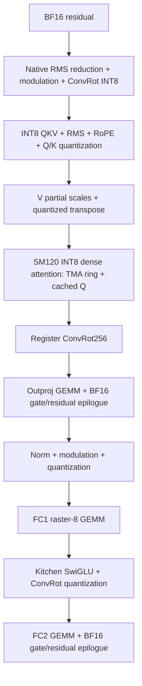

# Kitchen 0.2.36 migration

This release moves R85 from experiment overlays into a source-built, model-scoped ComfyUI package. The nine CUDA libraries were rebuilt from the files in this repository on an RTX 5090 D v2. Kitchen is the actual 0.2.36 wheel, not merely a changed version string. The comparison uses the same Larry v4 baked INT8 checkpoint and eight Euler/beta steps.

## DiT data flow

The chain is implemented in `h3_speedkit/runtime.py`. It uses prequantized tensors directly, so intermediate Python carrier objects and global Kitchen interception are unnecessary. Per-block instrumentation counts 50 QKV, 50 attention, 100 norm/quant, 50 FC1 and 100 gate launches per model evaluation. Eight sampler evaluations are measured separately.

| Optimization | Ported implementation | Numerical requirement |
|---|---|---|
| Dense main loop | `kernels/dense/` | All K/V, original online-softmax/PV order; three TMA slots and resident Q |
| BSHD attention output | dense binding | Remove a layout-copy path; output consumer receives the same logical data |
| Norm → modulation → ConvRot | `kernels/norm_quant/` | Pinned PyTorch reduction, explicit FP32 rounding and BF16 barriers |
| QKV preparation | `kernels/gemm/r84_kfourwarp.cu` | Preserve QKV dequant, norm, partial RoPE and quant scales |
| Current-input K anchors | `r82_sample_konly.cu`, `r79_sample_anchor.cu` | Recompute from nine rows of the current input; never reuse previous-step K |
| V preparation | `h3_speedkit/ops/quant_v.py` | Partial scales and transpose, independent scratch per call |
| Register ConvRot | `kernels/convrot/` | Kitchen arithmetic, row scales and integer rounding retained |
| FC1 raster | `kernels/gemm/fc1.cu` | Scheduling change, same INT8 dot products and epilogue |
| Outproj / FC2 gate | `kernels/gemm/gate.cu` | Preserve intermediate BF16 rounding before residual update |
| Dead embeddings | `vendor/model_forward.py` | Delete eleven dead local references; same operations/output |
| Final-layer query window | dense window + GEMM row slices | Skip only aligned non-target Q rows in block 49; every K/V remains |

The old residual→norm carrier kernel is included for traceability but is not active in this simpler chain. It must not be counted as an additional gain on top of fused gate output plus the new norm chain. Individual historical ablations are in [R85-OPTIMIZATION-CATALOG.md](R85-OPTIMIZATION-CATALOG.md); the [migration index](../evidence/migration-catalog.json) maps every record to its release state.

## Video and audio

The VAE loader creates a dedicated model instance. The old FP16 encoder classes are retained; the INT8 ViT3D decoder and fused input-activation helpers come from upstream ComfyUI/Kitchen. A generated 256×384 reference fixture produced exactly the old encoder latent. A 260-frame business latent produced the exact historical INT8 RGB output through the new node.

Final temporal blending completes before RGB conversion. Triton preserves FP32 normalization/clamping, multiplication by 255 and truncation; FMA contraction is disabled where it changes boundary values. RGB8 D2H transfers one byte per channel, compared with four for FP32. Two pinned slots bound transfer storage. CUDA events and `record_stream` protect buffer lifetime.

Audio remains GPU FP32. The historical CPU experiment took 4.49–9.44 seconds against approximately 0.11–0.14 seconds on GPU and changed PCM. It is not a default optimization.

The PyAV exporter uses the same BT.709 primaries/matrix, sRGB transfer, limited-range YUV420P, H.264/AAC and four video threads as the measured exporter. Real decoded MP4 frames matched on the checked 260-frame clip. The optional `ExportQueue` allows CPU encoding of N while a service runs GPU request N+1; it bounds pending jobs and retained tensor storage and propagates failure on drain. The ComfyUI Save Video node waits for its own MP4 to finish.

## Isolation and precision

`MODEL.clone()` alone does not isolate mutable underlying modules. SpeedKit uses Comfy's block-replacement map and diffusion wrapper; the optional embedding change is installed/restored by Comfy's object-patch lifecycle. It never replaces global Kitchen functions. It rejects conflicting block/attention patches. LoRA callbacks are not silently bypassed: use the verified merge tool or the ordinary fallback model path.

First-use checks include the model-source SHA, Torch revision, Kitchen version, SM120, INT8 ConvRot weight geometry, hooks, masks, quant layout, strides and dtype. Historical long-row layouts use their measured fast path. New layouts in the supported allocation envelope are compared against the original block for their first eight model evaluations. Each candidate writes into a private residual clone. Mismatch returns the intact reference and disables that layout for the model instance. This detects errors on those inputs; it is not a proof for every possible value. First-use verification costs time and memory and is excluded from steady-state speed claims.

Unsupported configurations fall back before optimized mutation. CUDA launch errors abort the request; the code does not retry an original block on a partially changed tensor.

## Further optimization in this migration

The packaged exporter avoids the historical child-process startup and temporary raw-file handoff. The decoded-output comparison passed; a separate complete-cycle benchmark is required before assigning an end-to-end percentage to that change. Shape qualification and source/ABI checks improve portability and correctness; they are not advertised as speed improvements.

CUTLASS v4.8 exists, but the measured source build uses v4.5.0. Upgrading the compiler, Torch, Kitchen or CUTLASS without a same-input comparison does not establish a benefit. Approximate caches, sparse attention, NVFP4 and a different LoRA are not included in the default claim.

## Final VAE migration regression

The packaged Kitchen 0.2.36 INT8 VAE + RGB8 path was rerun on all 15 historical saved latents. **15/15 raw RGB hashes exactly match R85**. This confirms output migration for those inputs; the single-pass durations are not an additional speed benchmark. [Records](../evidence/vae15-migration.json).

## Isolation tests

Seven real-GPU checks passed: disabled node clone, stock reference, no eager global forward mutation, exact unknown-layout fallback, deliberate candidate mismatch returning the untouched reference result, original clone exactness after candidate failure, and duplicate-patch rejection. The mismatch test perturbs one candidate value after its kernel chain; the private clone prevents that value from reaching the reference result. [Validation record](../evidence/isolation-validation.json).

## Workflow execution

The API graph passed ComfyUI `validate_prompt` and `PromptExecutor`, including real reference/Qwen encoding, model load, eight-step sampling, audio decode, SpeedKit RGB8 decode and final MP4 save. The validation used 384×256/124 frames and local model filenames. [Record](../evidence/workflow-validation.json). The canvas layout remains a convenience import, without a separate frontend qualification claim.

Integration tests exposed and fixed strict ABI checks for the `[N,1]` weight scale, the three modality rows per time embedding, the native decoder's leading batch dimension, and the pinned ModelSave integer-Parameter issue. These were failed development runs, not included in successful performance counts. New-layout verification clones the residual **before** invoking the original in-place block. The explicit mismatch test checks that behavior.
